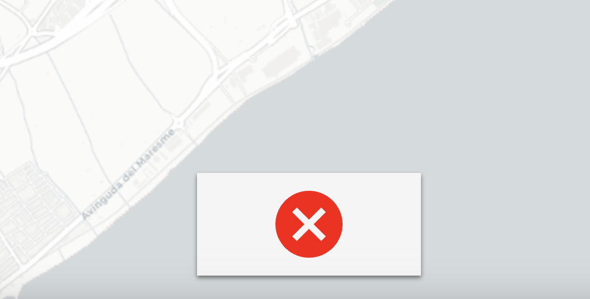
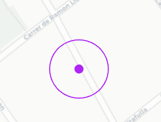
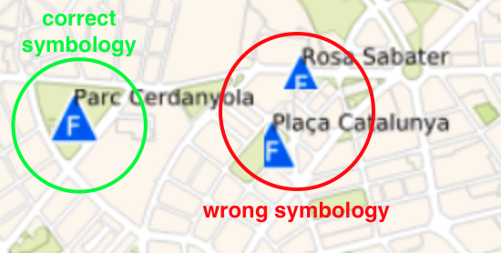
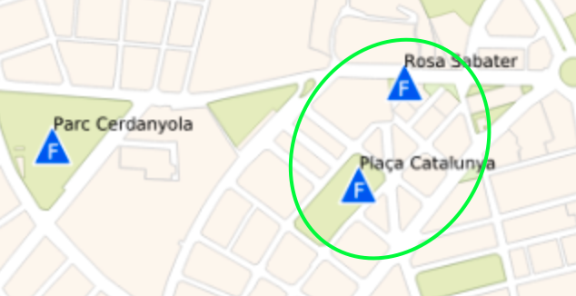

# Map Handler

#### Version 1.2.125 - February 2024

Tool to achieve the easiest way of communication with the map iframe.

- [Installation](#Installation)
- [Events](#Events)
- [Methods](#Methods)

Some of the multiple use case flows are documented in [flows.md](flows.md)

## TL;DR

```
<html>
  <body>
    <iframe id="map-frame" name="map-frame" src=""></iframe>
    <button id="btZoomIn">Zoom In</button>
    <script src="https://unpkg.com/@vidro/map-handler@1.0.5/dist/map-handler.js"></script> -->
    <script>
      var loadMapReq = new XMLHttpRequest();
      loadMapReq.addEventListener("load", function(){
        communicator = new VidroMaps.Communicator({this.responseText.message.sessionToken});
        document.querySelector("#map-frame").src = `${this.responseText.message.iframe}?sessionToken=${this.responseText.message.sessionToken}`;

        document.querySelector("#btZoomIn").addEventListener("click", function(){
          communicator.ZoomIn();
        });

      }
      loadMapReq.open("GET", "http://APIURL/map/PROJECT_ID",true);
      loadMapReq.setRequestHeader('Content-type', 'application/json');
      loadMapReq.setRequestHeader('Authorization',`Bearer ${USER_TOKEN}`);
      loadMapReq.send();
    </script>
  </body>
</html>
```

## Installation

### 0. Pre-requisites

You should have one iframe already created on the DOM with the attributes `name="map-frame" id="map-frame"`.

### 1. Include the library:

You can do this inyecting directly to window:

    <script src="path/to/lib.js"></script>
    <script src="path/to/your.js"></script>

Or if you're working with NPM / ES6:

    npm install --save @vidro/map-handler
    ...
    import { Communicator } from "@vidro/map-handler";

### 2. Instance the communicator with the sessionToken in options object:

If you are inyecting into window:

    var communicator = new VidroMaps.Communicator({
      sessionToken: sessionToken
    });

Or if you're working with NPM / ES6:

    const communicator = new Communicator({
        sessionToken: "sessionToken"
    });

### Logs

If you want to see `console.logs`, you can activate logs with `setDebug` method. Once map is loaded, invoke this method. Will create or remove a cookie. After calling `setDebug` reload the map.

Logs are deactivated by default.

`setDebug(debug)`

> E.G.

```
//activate
setDebug(1);

//deactivate
setDebug(0);
```

## Events

### How to listen

    communicator.on("onZoomChange", function(data){
      console.log("onZoomChange event",data);
    });

### Available events

##### onZoomChange

Notifies zoom level changed

##### geomAdded

Notifies geometry added to map and featureId

When this tool is used, NO geom is added when drawing finishes. In case you want to add it, use `Highlight` tool 


> E.G.

```
geom_astext: "POLYGON((418391.8715694032 4576832.484383419,418721.82301488414 4577299.667608328,418727.18131229794 4576947.724919814,418391.8715694032 4576832.484383419))"
featureId: "uuid of geometry added'
srid: 'EPSG:25831'
```

##### loaded

Notifies when map or layers are loaded.

There're two types of events:

- `map` is dispatched when map (with background) is loaded.
- `layer` is dispatched when a layer is loaded
- `tiled` is dispatched when a tiled is loaded

> `map` E.G:

```
{what:'map'}
```

> `layer` E.G:

```
{what:'layer'
name:'Arc'}
```

##### unloaded

Notifies when layers are unloaded.

There's one type of events:

- `layer` is dispatched when a layer is unloaded
- `tiled` is dispatched when a tiled is unloaded

> `layer` E.G:

```
{what:'layer'
name:'Arc'}
```

##### layers

Notifies an array of displayed layers

##### geoJSONlayers

Notifies an array of displayed GeoJSON layers

##### activeLayer

Notifies wich layer is marked as active

##### WMSInfoAvailable

Notifies when WMS is available for this map

##### availableWMSLayers

List of available layers from WMS server

##### getToc

Formatted Layers TOC (table of contents)

##### coordinates

Notifies clicked coordinates (x,y)

First coordinate is X value.

> E.G:

```
{coordinates: (2) [419463.63262834214, 4577166.970846243]
type: "coordinates"}
```

##### info

Notifies info results. There're 2 availables infos `wms` and `giswater`

> E.G `wms`:

```
{type: "info", infoType: "wms", data: "<GetFeatureInfoResponse>↵ <Layer name="Incidencia_…  </Feature>↵ </Layer>↵</GetFeatureInfoResponse>↵"}
```

> E.G `giswater`:

```
{type: "info", infoType: "giswater", data: {…}}
```

##### layerElements

Receives a list of elements from a `getElementsFromLayer request

```
{type: "layerElements", data: {xml or json}}
```

##### geolocation

Notifies user position, coordinates (x,y)

First coordinate is X value.

> E.G

```

{type: "geolocation", coordinates: Array(2)}
coordinates: (2) [419297.8249458591, 4576821.519666988]
```

##### Giswater tiled background

Giswater's tiled background has two events, one for notify if is available or not, and a another one for notify if is rendered or not

`giswaterTiledBackgroundAvailable` and `giswaterTiledBackgroundDisplayed`

```
{type: "giswaterTiledBackgroundAvailable", available: true/false}

{type: "giswaterTiledBackgroundDisplayed", visible: true/false, tiled: "tiled id"}
```

##### Giswater layer Available filters

List of available filters for a Giswater layer

```
{type: "GiswaterLayerAvailableFilters", filters: array}

```

##### error

Notifies errors

> E.G.

```
{type: "error", error: "No clicked coordinates"}
```

##### status

Notifies map status, as tiled loaded, background visible, etc..

## Methods

##### ZoomIn()

##### ZoomOut()

##### zoomToExtent()

##### zoomToCoordinates(coordinates,zoomLevel)

Zooms to given coordinates

> Params

- lat (x) `<integer>`
- long (y) `<integer>`
- zoomLevel `<integer>` - zoom level

> E.G.

```
zoomToCoordinates(419006.12985785044, 4576698.8136144625,18);

```
##### CenterMap(lat,long)

center map to given coordinates

> Params

- lat (x) `<integer>`
- long (y) `<integer>`

> E.G.

```
CenterMap(419006.12985785044, 4576698.8136144625,18);

```

##### AddGeom(string)

Launches drawing tools with the geometry type

> Params

- geom `<string>` - geometry type `Point` | `Line` | `Polygon`

Optional parameters

- `texts` (`object`): Texts to be displayed with draw tools.
  - `start` (`string`): E.G. "Click to start drawing"
  - `continnue`:(`string`): E.G. "Click to to continue drawing"
- `center` (`object`): Center options.
- `style` (`object`):
	- `fill` (`string`): The fill color for the drawn geometry.
	- `stroke` (`string`): The stroke color for the drawn geometry.
- `drawOnEnd` (`boolean`): Is is set to `false` geometry will not be added on end drawing. The event with the drawn geometry will still be emitted
- `showConfirm` (`boolean`): show or hide component for end drawing. If is set to false, `CancelAddGeom()` must be handled by the user.

Confirm component:


#### CancelAddGeom

Cancels draw geometry

> E.G.

```
CancelAddGeom();

```

> E.G.

```
AddGeom('Point');

AddGeom('Line');

AddGeom('Polygon');

//Draw polygon with no showConfirm
AddGeom('Polygon', {showConfirm: false});
```

An `geomAdded` event will be received after calling the method.

##### clear()

Clears drawn geometries

##### toggleLayer

Shows/hides a layer. 

***Important**

This method loads a single layer. If you need to load multiple layers, use `loadMultipleLayers()` method

If ypu need to load multiple layers

> Params

- layerName `<string>` - layer name
- properties `<object>` - _optional_ layer properties
  - gutter `<integer>` - The size in pixels of the gutter around image tiles to ignore, only applies for multitile layer
  - singletile `<boolean>` - SingleTile Layer
  - transparent `<boolean>` - Transparent Layer
  - type `<string>` - layer type (wms, geojson...)

By default, layer properties will be:

`gutter: 0`

`singletile: false` - will render a multitile layer

`transparent: true`

> E.G.

With no properties

```
toggleLayer('somelayer_name');
```

With properties

```
toggleLayer('somelayer_name', {gutter: 10, transparent: false, singletile: false);
```

##### loadMultipleLayers()

Loads multiple layers. Use this method if you want to load multiple layers.

>Params

- layers `<array>`: array of layers, each layer with same proerties than `toggleLayer` method.

##### setActiveLayer()

Sets a layer as acticve layer, used for infos

> E.G.

```
setActiveLayer('somelayer_name');
```

##### reloadDisplayedLayers

Reloads displayed layers

> E.G.

```
reloadDisplayedLayers();
```

##### loadWMSAvailableLayers

Gets a list of available layers from WMS server

> E.G.

```
loadWMSAvailableLayers();
```

An `availableWMSLayers ` event will be received after calling the method.

##### getToc

Gets a formatted Layers TOC (Table of contents)

> E.G.

```
getToc();
```

An `getToc ` event will be received after calling the method.

##### getElementsFromLayer

Gets a list of elements from a layer, based on a WMS request

```
getElementsFromLayer(layer,limit,format)
```

> Params

- layer `<string>` - layer name
- limit `<integer>` - limit output number of elements (default 100)
- format `<string>` - output format
  - `xml` - default
    - `json`

##### infoFromCoordinates

There're two available info from coordinates `wms` or `giswater`.

**Important** a `click on the map` must be done before calling this method.
If you don't specify a layer, will use the layer setted as `Active layer`

> Params

- type `<string>` - info type

  - `wms` - wms info

  - `giswater` - giswater info
  - `geojson`- geojson info

- layer `<string>` _optional_ layer name to do info. If null, will use current active layer.
- hitTolerance `<integer>` _optional_ for geoJSON Info, pixels inside the radius around the given will be checked for features. Default `5`.
- format `<string>` _optional_ - output format for WMS requests
  - `xml` - default
    - `json`

> E.G.

```
infoFromCoordinates('wms'); //will use active layer

infoFromCoordinates('giswater');
infoFromCoordinates('giswater','Arc');
infoFromCoordinates('wms','Arc',null,'json'); //will use active layer and json output
```

An `info` event will be received after calling the method.

##### Geolocalize

Geolocalizes user. Will dispatch `geolocation` event .

> Params

- toggle `<Boolean>` - starts or cancels geolocation

> E.G.

```
//start
Geolocalize(true)

//cancel
Geolocalize(false)
```

**Important** Add ` allow="geolocation"` to html iframe tag.

##### Higlight

Highlights & draws a geometry. Allows animation and zoom to element.
If you want to draw a geom, just use `DrawGeometries` method

Params

- `geom` (`string`): The geometry string in WKT to highlight.

Optional parameters

- `zoom` (`object`): Zoom options.
  - `type` (`string`): The type of zoom (`level` or `element`).
    - `level`: Zoom to a specific zoom level.
    - `element`: Zoom to the center of the geometry.
  - `zoomLevel` (`number`, optional): The zoom level (1 to 28). Required if `type` is set to `level`.
- `center` (`object`): Center options.
- `data` (`object`): Additional data associated with the highlight.
  - `feautureId` (`string`): The ID of the feature.
  - `name` (`string`): The name of the feature.
  - ... any extra data will be added to feature
- style (`object`): geometry styling options
	- `fill` (`string`): The fill color for the highlighted geometry.
	- `stroke` (`string`): The stroke color for the highlighted geometry.
- `animate` (`boolean`): Indicates whether to animate the highlight.
	- `duration`: time of the animation in milliseconds
	- `repeat`: true/false for repeteating animation

Example of animation




> E.G.

```
//Highlight a line and zoom to level 6

let options = {
	'geom': 'MULTILINESTRING((418596.62555076234 4577083.383681167,419026.2319996517 4577216.795306675))',
	'zoom':{
		'type':'level',
		'zoomLevel':6
	}
}

Highlight(options);

//Highlight a line to geometry center

let options = {
	'geom': 'MULTILINESTRING((418596.62555076234 4577083.383681167,419026.2319996517 4577216.795306675))',
	'zoom':{
		'type':'element'
	}
}

Highlight(options);
```


##### DrawGeometry - DEPRECATED

**use `DrawGeometries`**

Draws a single geometry, in case you want to draw multiple geometries simultaneusly use `DrawGeometries ` method


> E.G.

```
//Draw a geometry with yellow stroke

const geom = 'MULTILINESTRING((418596.62555076234 4577083.383681167,419026.2319996517 4577216.795306675))'

const style = {
		stroke_color: "rgb(233, 244, 75)"
	}
}

DrawGeometry(geom,style,'sampleName','mockId');

```

##### DrawGeometries

Draws geometries

>Params

- geoms `<array>`: 
	- item `<object>`:
		- geom `<string>` - geometry string
		- style `<object>`
			- stroke_color `<string>`
			- fill_color `<string>`
			- geom_radius `<integer>`
			- stroke_width `<integer>`
			- font_color `<string>`
			- font `<string>`
			- placement `<string>`
			- fontFillColor `<string>`
		   	- fontStrokeColor `<string>`
			- display `<string>`
			- fontStrokeWidth `<integer>`
			- offsetY `<integer>`
			- baseline `<string>`
			- align `<string>`
		- name `<string>` feauture name
		- id `<string>` feauture id

> E.G.

```
//Draw a geometry with yellow stroke

const geom = 'MULTILINESTRING((418596.62555076234 4577083.383681167,419026.2319996517 4577216.795306675))'

const style = {
		stroke_color: "rgb(233, 244, 75)"
	}
}
const item = {geom,style,'sampleName','mockId'};
DrawGeometries([item]);
```


##### RemoveGeometry 

Removes a geometry by ID

Params

- id `<string>` - rendered geometry unique
- layer `<string>` - layer name, optional

> E.G.

```
RemoveGeometry('25', 'somlayer')
```

##### RemoveGeometriesByProperty

Removes geometries by property value

Params

- layer `<string>` - layer name, optional
- property `<string>` - property name
- value - property value

> E.G.

```
RemoveGeometriesByProperty( 'somlayer','type','something')
```

##### UpdateGeometriesByProperty

Update geometry style based on property value

Params

- layer `<string>` - layer name, optional
- property `<string>` - property name
- value - property value
- style `<object>`
			- stroke_color `<string>`
			- fill_color `<string>`
			- geom_radius `<integer>`
			- stroke_width `<integer>`
			- font_color `<string>`
			- font `<string>`
			- placement `<string>`
			- fontFillColor `<string>`
		   	- fontStrokeColor `<string>`
			- display `<string>`
			- fontStrokeWidth `<integer>`
			- offsetY `<integer>`
			- baseline `<string>`
			- align `<string>`

> E.G.

```
UpdateGeometriesByProperty( 'somlayer','type','something',{
stroke_color: "rgb(255, 0, 0)"}
)
```

##### toggleTiled

Deprecated `toggleGiswaterTiled`

Toggles tiled background (in case tiled background is configured)

Params

- toggle `<boolean>` shows/hides tiled background
- tiled `<string>` tiled background name

> E.G.

```
toggleTiled(true);

```

##### toggleSecondaryBackground


Toggles secondary background (in case secondary background is configured)

Params

- toggle `<boolean>` shows/hides secondary background


> E.G.

```
toggleSecondaryBackground(true);

```


##### addGeoJSON

Adds geoJSON layer

Params

- geoJSON `<geoJSON>` geoJSON data

- options `<json>` layer options

  - fillcolor `<string>` fill color. If null will use red color (#ff0000)
  - strokecolor `<string>` strokecolor color. If null will use red color (#ff0000)

- name `<string>` geoJson layer name, if null will use a random string

> E.G.

```
addGeoJSON(geoJSON,options, name);


addGeoJSON('GeoJSONContent',{},null);

const options = {
	fillcolor:'#e3ff00',
	strokecolor: '#e3ff00'
}

addGeoJSON('GeoJSONContent', options,'name');

```

##### removeGeoJSONLayer

Removes a GeoJSON Layer

```
removeGeoJSONLayer(layerName);

removeGeoJSONLayer('somename');
```

##### clearGeoJSON

Clears geoJSON layers

> E.G.

```
clearGeoJSON();
```

##### setFilters
Deprecated `setGiswaterFilters`


Set filters for displayed layers

Filters must be a JSON with valid fields. On Giswater/QGIS projects, available layer filters can be obtained with method `getGiswaterLayerAvailableFilters`

```
setFilters(JSON);
```

> E.G.

```
setFilters({"expl_id":[1,2,3]});
```

##### getGiswaterLayerAvailableFilters

Get available WMTS filters for a Giswater layer

```
getGiswaterLayerAvailableFilters(layername);
```

> E.G.

```
getGiswaterLayerAvailableFilters("Arc");
```

##### setCustomColors

Sets colors and stroke width for added & highlight geometries.

Properties:

- `geom_stroke_color` - stroke color in RGB format
- `geom_fill_color` - fill color in RGB format
- `geom_stroke_width` - stroke width in pixels, default 1.
- `geom_shape` - shape por point, `circle`(default) or `square`
- `geom_radius` - point radius or square side in pixels. Default 4.

```
setCustomColors({geom_stroke_color, geom_fill_color, geom_stroke_width,geom_shape});
```

> E.G.

```
setCustomColors({
		geom_stroke_color: 'rgb(19, 39, 99,0.5)',
		geom_fill_color: 'rgb(19, 39, 99,0.5)',
    	geom_stroke_width: 1,
    	geom_shape: 'circle',
    	geom_radius: 2
    	});
```

On Bmaps projects, default values are taken from Backoffice:

```
geom_stroke_color -> Bmaps: geom_select_stroke_color
geom_fill_color -> Bmaps: geom_select_fill_color
```

##### changeBackground

Change background

Properties:

- `newBackgroud` - background name (OSM, google, CartoDBLight,CartoDBDark)

```
changeBackground('google');
```

##### initMeasure

Starts measure tools

Properties:

- `type` - measure type `line` or `area`
- `textStart` - helper text to display when tool starts
- `textContinue` - helper text to display when tool continues

```
initMeasure('line','Click for start measuring','Clic for continye measuring`);
```

##### cancelMeasure

Stop measure tools

```
cancelMeasure();
```

### Multiple iframes

Is possible to use multiple iframe on a single page, follow this steps.

- Set to your `iframe` tags the id & value
- Add to each `iframe.src` `&domId=IFRAME_ID`
- Instantiate each iframe:

```
var communicator = new VidroMaps.Communicator({
      sessionToken: sessionToken,
      id:'IFRAME_ID'
});
```

## Examples

### Simple

`examples/simple/`

A simple integration with just zoom buttons

##### How it works

1. Gets user, password and API url from the url
2. Request a user token to the API
3. Loads the first map of the user

[https://www.vidrosoftware.com/examples/simple/?user=USER&pwd=USER_PASWORD&api=API_URL]()

### Full

`examples/full/`

Full integration

##### How it works

1. User, password and API url are defined on the html form
2. Stores token and last map loaded in a fake cache
3. There's a form for choosing map and customize map parameters

[https://www.vidrosoftware.com/examples/full/]()

### Vidromaps

`examples/vidromaps/`

Vidromaps integration

##### How it works

1. Paste iframe code

[https://www.vidrosoftware.com/examples/vidromaps/]()

### Serverless

`examples/serveLess/`

Server less sample integration

##### How it works

1. Gets user, password and API url from the url
2. Request a user token to the API
3. Loads the first map of the user with one layer rendered
4. On map click, performs an wms info, displays one attribute, highlights the clicked point and centers map on that point

### Mutiple iframes

`examples/multipleiframes/`

Multiple iframes integration

##### How it works

1. Replace `YOUR_SESSION_TOKEN` with your session token code on both inputs `code1` and `code2`.

[https://www.vidrosoftware.com/examples/multipleiframes/]()

### Known issues

- **Custom logo is not displayed**

Could be CORS issue. Check the headers sent by your server.

With Apache can be solved with and `.htaccess` file with this content:

```
Header set Access-Control-Allow-Origin "*"
Header add Cross-Origin-Resource-Policy: "cross-origin"
Header add Cross-Origin-Embedder-Policy: "require-corp"
```

- **QGIS Broken symbology**

QGIS multi tile layers could show broken symbology:



This can be solved using `singletile: true` or adding `gutter: value in pixels` if is a multitiule layer, on toggleLayer method.

Is if is a Giswwater project, you can set this options (`Render mode` and `Gutter`) on Bmaps backoffice.


