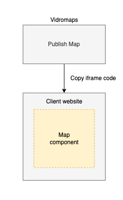
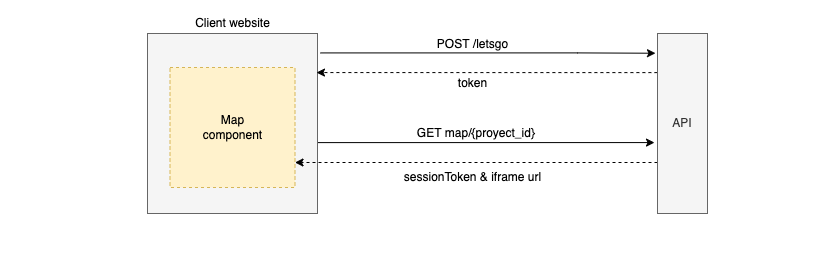
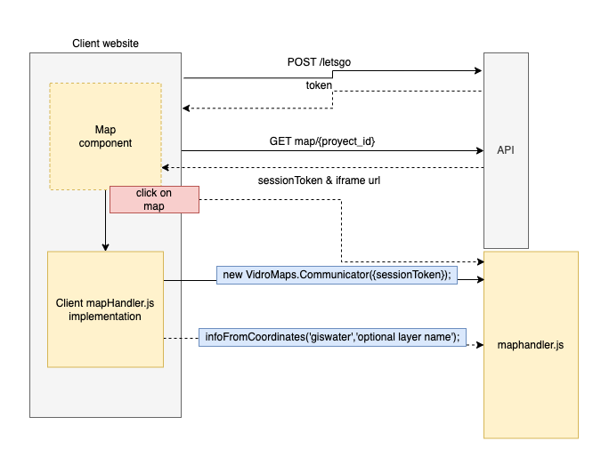
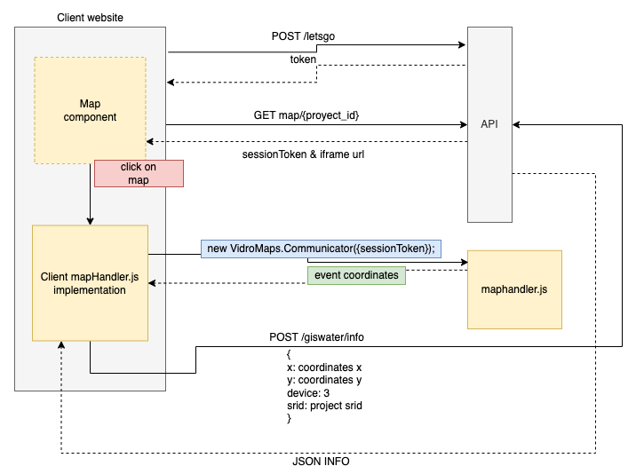
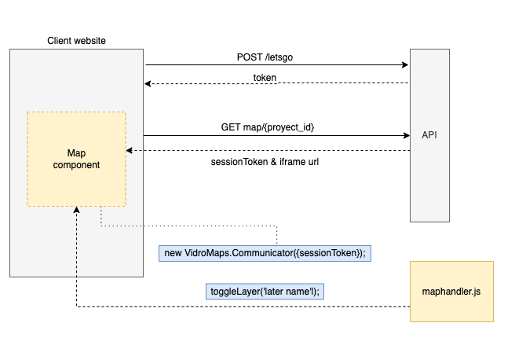
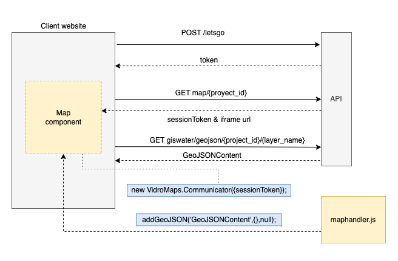

# Map Handler flows

This document defines use case flows of map handler

## Vidromaps basic flow

Vidromaps basic flow

1. Login to giswater - API `letsgo`
2. Get map - API `map/{project_id}`
3. Load iframe

## Giswater basic flow

Giswater basic flow

1. Login to giswater - API `letsgo`
2. Get map - API `map/{project_id}`
3. Load iframe

## Giswater info

Giswater info can be performed using mapHandler or usind API REST methods

1. Login to giswater - API `letsgo`
2. Get map - API `map/{project_id}`
3. Load iframe
4. Instance mapHandler - `new VidroMaps.Communicator({sessionToken});`
5. Click on map

**Using mapHandler**

6. Info`mapHandler.js` method [**`infofromcoordinates `**](https://github.com/Vidro-Software-SL/maphandler#infofromcoordinates)

**Using API REST**

6. Listen event [**`coordinates`**](https://github.com/Vidro-Software-SL/maphandler#coordinates)
7. POST to API `giswater/info` with x, y, srid and device parameters.

## Giswater display layer

Display a Giswater layer using mapHandler

1. Login to giswater - API `letsgo`
2. Get map - API `map/{project_id}`
3. Load iframe
4. Instance mapHandler - `new VidroMaps.Communicator({sessionToken});`
5. Render layer using `mapHandler.js` method [**`toggleLayer`**](https://github.com/Vidro-Software-SL/maphandler#togglelayer)

## Giswater JSON layer

Giswater layers can be rendered as geojson.

1. Login to giswater - API `letsgo`
2. Get map - API `map/{project_id}`
3. Load iframe
4. Get geojson data for a layer - API `giswater/geojson/{project_id}/{layer_name}`. 
5. Instance mapHandler - `new VidroMaps.Communicator({sessionToken});`
6. Render geojson data using `maphandler.js` method [**`addGeoJSON`**](https://github.com/Vidro-Software-SL/maphandler#addgeojson)

